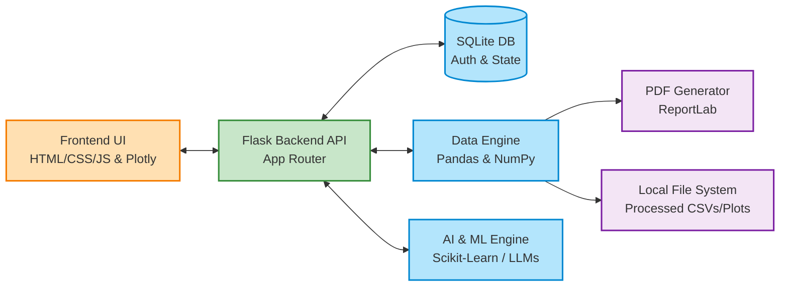
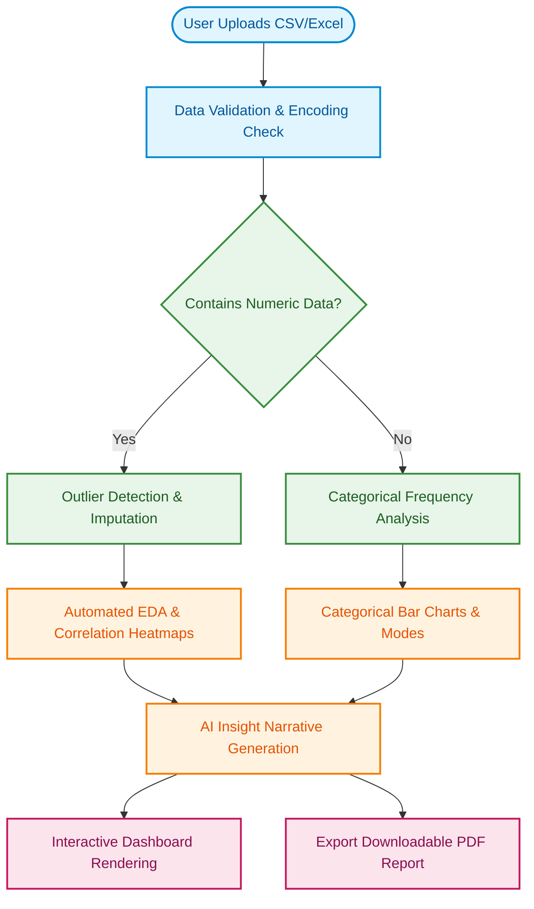

# AI-Powered Data Analysis & Visualization Platform

End-to-end AI platform that automates data ingestion, preprocessing, analysis, model evaluation, and visualization to deliver actionable insights with minimal manual effort. Designed to help teams quickly move from raw data to decision-ready insights.

---

##  Key Features

| Category | Feature Description |
| :--- | :--- |
| **Ingestion** | Seamless upload of CSV and Excel (`.xlsx`, `.xls`) files. |
| **Preprocessing** | Smart data cleaning, missing value handling, and outlier detection. |
| **EDA & Visuals** | Automated Exploratory Data Analysis (EDA) with interactive Plotly visualizations. |
| **AI Insights** | Automated narrative generation summarizing dataset anomalies, distributions, and correlations. |
| **Modeling** | Baseline model training and evaluation using Scikit-Learn pipelines. |
| **Export & Reports** | Downloadable comprehensive PDF reports (powered by ReportLab) and clean CSV datasets. |

---

##  System Architecture

The platform follows a robust Client-Server architecture, separating the interactive web frontend from the heavy data-processing backend.



---

##  System Workflow

The user journey is fully automated, translating raw unstructured tabular data into highly readable charts and actionable insights.



---

##  Technology Stack

| Component | Technology | Role |
| :--- | :--- | :--- |
| **Backend Framework** | `Flask` | API routing, session management, and server logic |
| **Data Engine** | `Pandas` / `NumPy` | DataFrame manipulation, CSV/Excel reading, aggregation |
| **Machine Learning** | `Scikit-Learn` | Baseline model training, statistical metrics |
| **Data Visualization** | `Plotly` / `Matplotlib` | Interactive web charts and static plots for PDF reports |
| **Report Generation** | `ReportLab` | Creating robust, styled A4 PDF documents dynamically |
| **Frontend Styling** | `Bootstrap` / `AOS` | Responsive, animated user interface |

---

##  Project Structure

```text
AI-Powered-Data-Analysis-Platform/
│
├── README.md                 # Project Documentation
├── run.py                    # Application Entry Point
├── requirements.txt          # Python Dependencies
├── .env                      # Environment Variables
│
├── backend/                  # Flask Application Root
│   ├── app.py                # Main application logic & routes
│   ├── config.py             # App configuration settings
│   ├── credentials.py        # Authentication/DB config
│   ├── forms.py              # WTForms definitions
│   ├── __init__db.py         # Database initialization scripts
│   ├── static/               # CSS & JS assets
│   ├── templates/            # Jinja2 HTML templates
│   │   ├── base.html         # Base layout
│   │   ├── upload.html       # File upload page
│   │   ├── result.html       # Automated insights dashboard
│   │   ├── visualize.html    # Interactive Plotly UI
│   │   └── configure.html    # Preprocessing configuration
│   └── uploads/              # Raw user uploads directory
│
├── instance/                 # SQLite Database storage
├── processed/                # Output Directory
│   ├── plots/                # Matplotlib figures for PDF
│   └── *_report.pdf          # Final generated reports
└── __pycache__/  
```

---

##  Quickstart Guide

### Prerequisites
- Python 3.9+ (Python 3.13 supported)
- Git

### Installation

1. **Clone the repository:**
   ```bash
   git clone https://github.com/keshavmishra27/AI-Powered-Data-Analysis-and-Visualization-Platform-with-Automated-Insights.git
   cd AI-Powered-Data-Analysis-and-Visualization-Platform-with-Automated-Insights
   ```

2. **Create and activate a virtual environment:**
   - **macOS / Linux:**
     ```bash
     python -m venv venv
     source venv/bin/activate
     ```
   - **Windows:**
     ```powershell
     python -m venv venv
     venv\Scripts\activate
     ```

3. **Install dependencies:**
   ```bash
   pip install -r backend/requirements.txt
   ```

4. **Run the Application:**
   ```bash
   python run.py
   ```

5. **Start Analyzing:**
   Open [http://localhost:5000](http://localhost:5000) in your browser. Register an account, upload a dataset (`.csv` or `.xlsx`), and let the AI build your dashboard!

---

##  Impact
- **60% Time Saved:** Drastically reduces manual analysis workload by automating standard preprocessing and reporting.
- **Decision Ready:** Helps non-technical teams rapidly convert raw data into actionable PDF reports and interactive charts.
