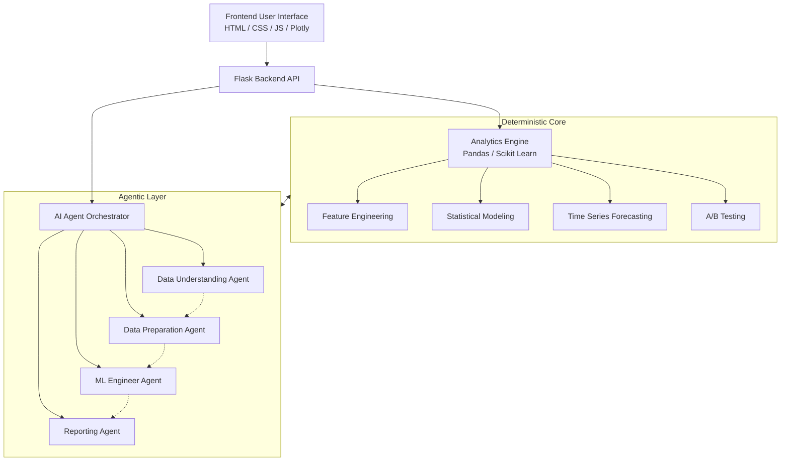
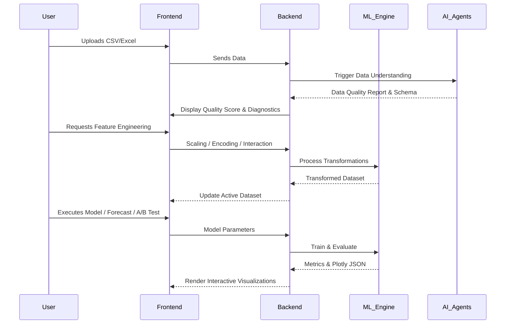

# Insight Forge Stathon 2025 Project

Insight Forge has evolved into an **Advanced Analytics Studio** and **AI powered tabular data intelligence platform** designed for comprehensive data science workflows.

The architecture shifts away from synthetic datasets and hardcoded rulebooks into a flexible pipeline that combines multi agent intelligence with a rich suite of statistical and analytical tools.

---

## System Architecture

The system operates on a dual layer architecture: a **Deterministic Core** for rigid statistical calculations and an **Agentic Layer** for LLM driven decision making and reporting.



---

## Data Processing Flowchart

Below is the standard workflow of how data moves from upload to final analytical insights:



---

## Technology Stack

| Layer | Technologies Used | Purpose |
| :--- | :--- | :--- |
| **Frontend** | HTML5, CSS3, JavaScript, Bootstrap, AOS | Responsive UI and animations |
| **Visualization** | Plotly.js | Interactive charts and diagnostic plots |
| **Backend** | Python, Flask, Werkzeug | API routing and server management |
| **Data Science Core** | Pandas, Scikit Learn, SciPy, Statsmodels | Data manipulation, ML training, statistics |
| **AI / LLM** | Ollama, Local LLMs (TinyLlama/Llama 3) | Intelligent agents and NLP generation |

---

## Core Features & Analytics Studio

### 1. Advanced Analytics Studio
* **Dataset Selection**: Seamlessly load and switch between uploaded datasets or synthetic case studies.
* **Feature Engineering**: Perform critical transformations including scaling (Standard, MinMax), categorical encoding (One Hot, Label), datetime decomposition, and generating interaction or polynomial terms.
* **Statistical Modeling**: Run comprehensive Regression and Classification models, featuring dynamic performance diagnostics (R Squared, RMSE, Accuracy, Precision) and interactive Plotly visualizations (Residuals, Confusion Matrices, ROC curves).
* **Hypothesis Testing**: Conduct T Tests, ANOVA, and Chi Square tests to derive statistically rigorous insights.
* **Time Series Forecasting**: Project target variables into the future using Holt Linear, Simple Exponential Smoothing (SES), or Time Index Linear Regression models.
* **A/B Testing**: Evaluate experiment results through a Manual Calculator (Z Test) or a Dataset Driven Analyzer with detailed lift and statistical significance reporting.

### 2. Case Studies Simulation Engine
* **Telecom Customer Churn**: Interactive dashboard to simulate financial impact of targeting high risk customers with customizable thresholds and retention rates.
* **E Commerce RFM Segmentation**: Perform unsupervised KMeans clustering on customer data to discover actionable marketing segments.
* **Retail Sales Forecasting**: Project future baseline sales with integrated promotional marketing boost modeling.
* **SaaS Price Elasticity**: Interactive demand curve calculator to find optimal revenue price points based on competitor pricing and marketing spend.

### 3. Multi Agent Pipeline

| Agent | Module | Primary Responsibilities |
| :--- | :--- | :--- |
| **Data Understanding** | `agents/data_understanding.py` | Computes deterministic Data Quality Scores and translates schema implications into human readable text. |
| **Data Preparation** | `agents/data_preparation.py` | Suggests and applies dynamic data cleaning techniques, tracking quality shifts before and after processing. |
| **ML Engineer** | `agents/ml_engineer.py` | Identifies analytical goals, prevents target leakage, selects appropriate algorithms, and benchmarks models. |
| **Reporting** | `agents/reporting.py` | Generates LLM grounded JSON Confidence Reports, describing model reliability, reasons for confidence, and actionable warnings. |

---

## Project Structure

```text
backend/
├── agents/             # High level orchestration agents (ML Engineer, Data Prep, etc.)
├── core/               # Low level deterministic ML logic (pandas/scikit learn)
├── exports/            # Export utilities (Excel, PDF, pipeline JSON)
├── llm/                # LLM prompting and structured JSON parsing
├── templates/          # User facing frontend views (Stathon 2025 styled)
└── analytics_engine.py # Core engine for modeling, forecasting, and hypothesis testing
```

---

## Running the App

```bash
# Set up environment
pip install -r requirements.txt

# (Optional) For local AI fallback, requires Ollama running with `tinyllama`
ollama run tinyllama

# Run server
python app.py
```
